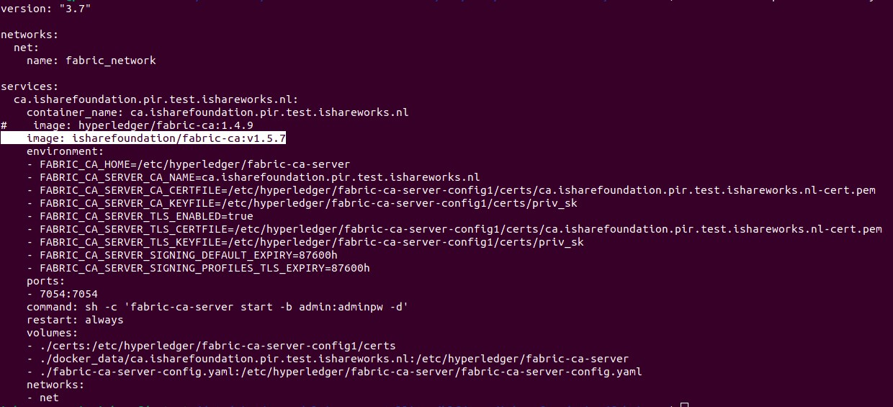
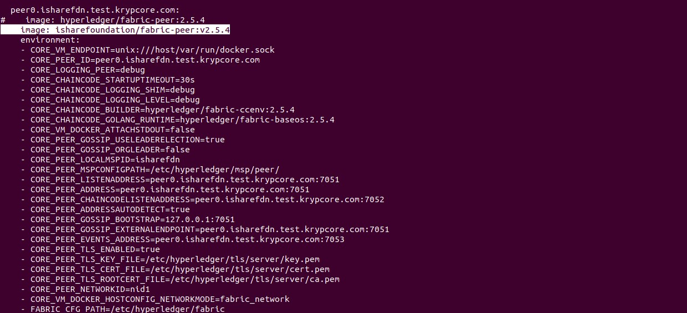
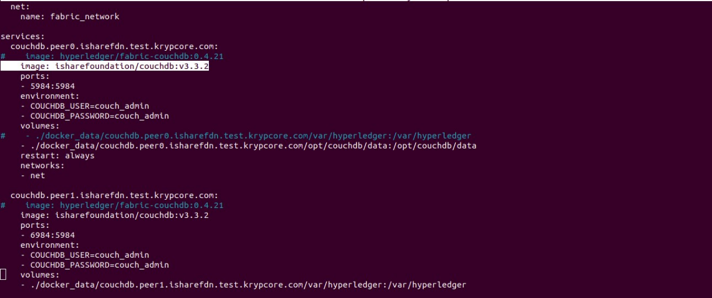
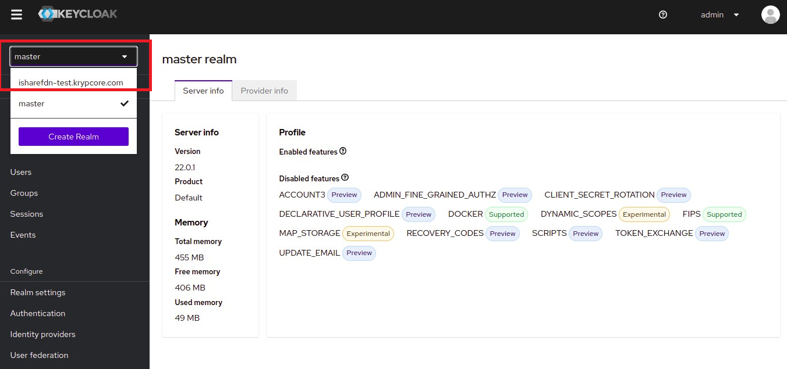
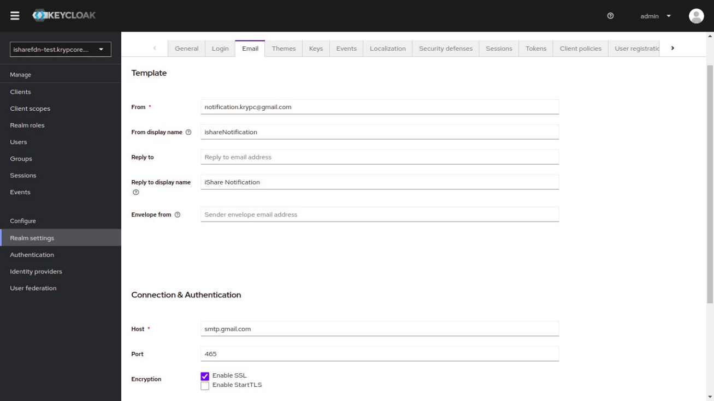
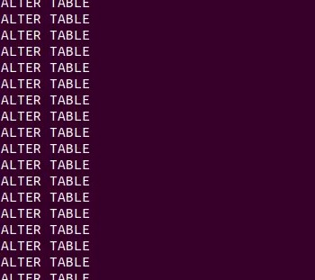
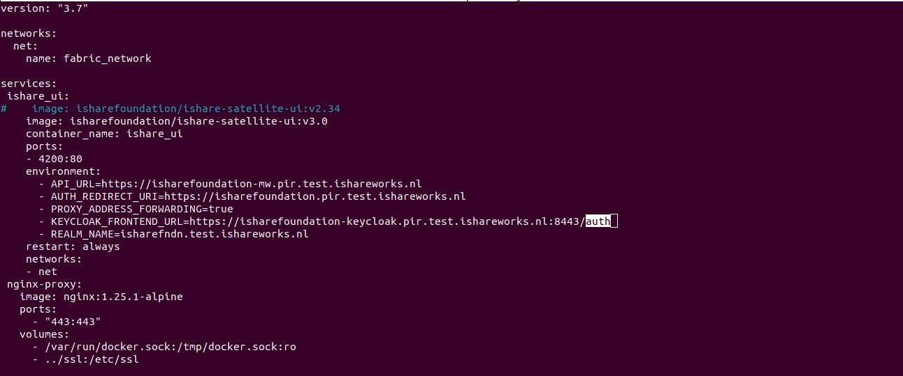
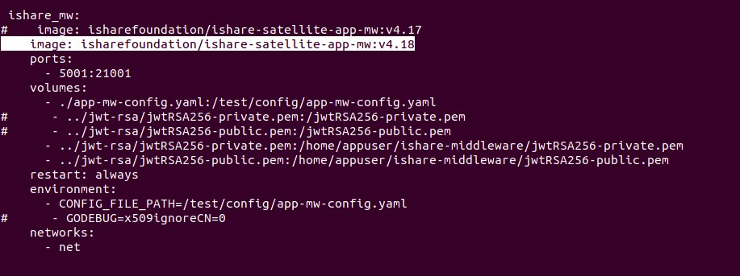
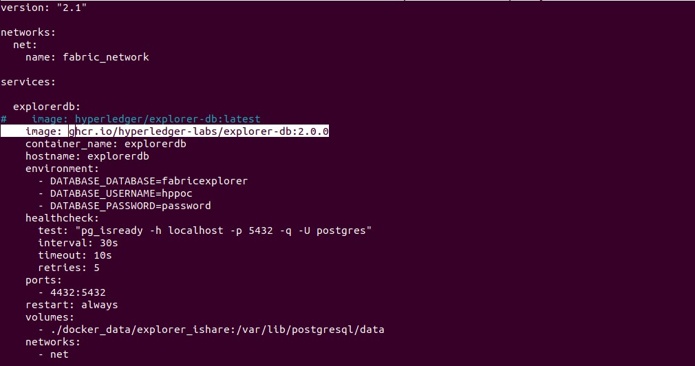
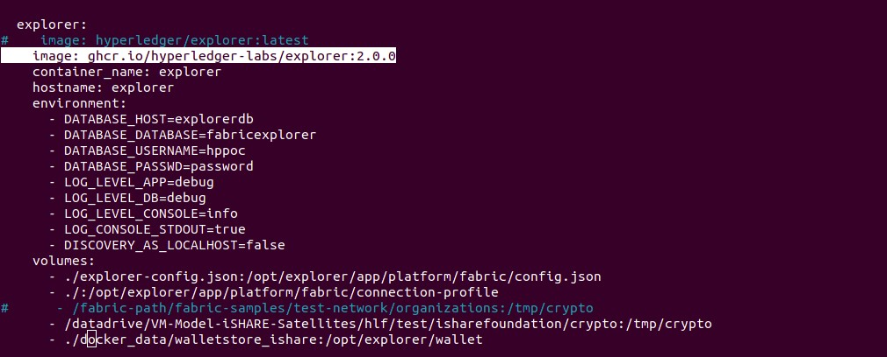

**iSHARE Satellite Components Migration Manual**

# Table of Contents

[Introduction ](#introduction)

[List of Components ](#list-of-components)

[Pre-requisites ](#pre-requisites)

[Component #1: Fabric CA](#component-1-fabric-ca)

[Component #2: Peer ](#component-2-peer)

[Component #3: Couch DB](#component-3-couch-db)

[Component #4: Key Cloak](#component-4-key-cloak)

[Component #5.1: Postgres DB -- Key Cloak](#component-5.1-postgres-db-key-cloak)

[Component #6.1: Application Components-UI](#component-6.1-application-components-ui)

[Component #6.2: Application Components-MW](#component-6.2-application-components-mw)

[Component #6.3: Postgres DB -- Offchain Data](#component-6.3-postgres-db-offchain-data)

[Component #6.4: Application Components-HLF Middleware](#component-6.4-application-components-hlf-middleware)

[Component #6.5: Application Components-Chain Code](#component-6.5-application-components-chain-code)

[Component #7: Explorer](#component-7-explorer)


# Introduction

This document explains the migration activity of the existing components.

> [!note]
> Please make sure to perform backup/snapshot of the VM before proceeding with upgrade. Please refer to your provider for instructions on how to take VM backup/snapshot including the disks.

# List of Components

1.  Fabric CA

2.  Peer

3.  Couch DB

4.  Key Cloak

5.  Application components

    a.  UI & Nginx

    b.  MW

    c.  HLF middleware

    d.  Chain code

6.  Postgress DB

7.  Explorer


# Pre-requisites

To be executed once at the start.

1. Stop all the docker container. Execute the below command:

```shell
docker stop $(docker ps -aq)
```
2. Take the entire setup backup. Navigate to the right directory where **iSHARESatellite** folder is and execute the below command.

```shell
sudo zip -r $(date +"%Y%m%d")_iSHARESatellite.zip iSHARESatellite
```
> [!Note]
> If you get error; zip command not found then either install 'zip' application or use alternative as you prefer.

3. hostname of keyclock will be needed during the upgrade, so fetch that already.

# Component #1: Fabric CA

1.  Once entire system setup back up is completed, Start the containers using the below given docker command.
```shell
docker start $(docker ps -aq)
```
1.  Ensure that all the containers are running properly, using the below command:

```
docker ps
```

2.  Redirect to below directory. Change the *environment* and *orgname* appropriately in the below command.

```shell
cd iSHARESatellite/hlf/<Environment>/<orgName>/fabric-ca
```


3.  Using the below command, stop the docker container.
```shell
docker-compose -f docker-compose-fabric-ca.yaml down
```

4.  Take the particular docker_data backup and create a backup of
    docker-compose-fabric-ca.yaml file. Execute the below two commands
    for the backup activity.

```shell
sudo zip -r docker_data-ca-bkup_$(date +"%Y%m%d").zip docker_data/
```

```shell
cp docker-compose-fabric-ca.yaml docker-compose-fabric-ca.yaml-bkup$(date +"%Y%m%d")
```

5.  Open the docker-compose-fabric-ca.yaml and comment the current image
    getting used and add the updated image save the file. Refer the
    below snip on the highlighted command.

```shell
nano docker-compose-fabric-ca.yaml
```

```shell
image: isharefoundation/fabric-ca:v1.5.7
```
>
> 

6.  Execute the below commands in the same given order, which in turn
    provides permission for the directory and its contents.

```shell
sudo chmod -R 777 docker_data/
```
```shell
sudo chmod -R 777 certs/
```

7.  Execute the below commands in the same given order, which allows to change the ownership of the directory and its contents.

```shell
sudo chown -R 1001:1001 docker_data/
```
```shell
sudo chown -R 1001:1001 certs/
```
8.  Start the container with the latest upgraded version using the below command.

```shell
docker-compose -f docker-compose-fabric-ca.yaml up -d
```
9.  Verify the container's docker logs to make sure if container is running fine.
```shell
docker-compose -f docker-compose-fabric-ca.yaml logs -f
```
You can press ctrl+c to exit

# Component #2: Peer

1.  Redirect to `iSHARESatellite/hlf/<Environment>/<orgName>/peers` directory. Change the *environment* and *orgname* appropriately in the command.

```shell
cd ../peers
```

2.  Using the below command, stop the docker container.

```shell
docker-compose -f docker-compose-hlf.yaml down
```
3.  Take the particular docker_data backup and create a backup of docker-compose-hlf.yaml file. Execute the below two commands for the backup activity.


```shell
sudo zip -r docker_data-ca-bkup_$(date +"%Y%m%d").zip docker_data/
```

```shell
cp docker-compose-hlf.yaml docker-compose-hlf.yaml-bkup_$(date +"%Y%m%d")
```

4.  Open the docker-compose-hlf.yaml and look for "peer0.<orgDomain>:" under services. Update the values as shown in snip 1 to update image version and refer to snip 2 to add the highlighted lines in the environment section and comment/replace the existing lines and save the file. 

> [!Note]
> You follow these steps one by one for both peers; i.e. peer0 and peer1

```shell
nano docker-compose-hlf.yaml
```

```shell
image: isharefoundation/fabric-peer:v2.5.4

    - CORE_CHAINCODE_BUILDER=hyperledger/fabric-ccenv:2.5.4
    - CORE_CHAINCODE_GOLANG_RUNTIME=hyperledger/fabric-baseos:2.5.4
```

>
> 
>
> 

5.  Execute the below command, which in turn provides permission for the directory and its contents.

```shell
sudo chmod -R 777 docker_data/
```

6.  Execute the below command, which allows to change the ownership of
    the directory and its contents.
```shell
sudo chown -R 1001:1001 docker_data/
```
7. Execute the below command to provide permission for the directory and its contents.

```shell
sudo chmod -R 777 ../crypto
```

8.  Start the container with the latest upgraded version of peer using
    the below command.

```shell
docker-compose -f docker-compose-hlf.yaml up -d
```

9.  Verify the container's docker logs to make sure if container is
    running fine.

```shell
docker-compose -f docker-compose-hlf.yaml logs -f <peer0name>
```

10. Now upgrade peer1; execute steps 4 by changing image version to latest upgraded version for "peer1.<orgDomain>:" under services followed by steps 8 and 9.


# Component #3: Couch DB

1.  Redirect to `iSHARESatellite/hlf/<Environment>/<orgName>/peers` directory if not there already. Change the *environment* and *orgname* appropriately in the below command.

```shell
cd iSHARESatellite/hlf/<Environment>/<orgName>/peers
```

1.  Using the below command, stop the docker container.

```shell
docker-compose -f docker-compose-hlf.yaml down
```
2.  Open the docker-compose-hlf.yaml and comment the current image getting used and add the updated image on both couchdb.peer0 and couchdb.peer1 and save the file. Refer the below snip on the highlighted command.

```shell
nano docker-compose-hlf.yaml
```

```shell
image:isharefoundation/couchdb:v3.3.2
```

> 

3.  Execute the below command, which in turn provides permission for the directory and its contents.

```shell
sudo chmod -R 777 docker_data/
```

4.  Execute the below command, which allows to change the ownership of the directory and its contents.

```shell
sudo chown -R 1001:1001 docker_data/
```

5.  Start the container with the latest upgraded version using the below
    command.

```shell
docker-compose -f docker-compose-hlf.yaml up -d
```


6.  Verify the container's docker logs to make sure if container is
    running fine.

```shell
docker-compose -f docker-compose-hlf.yaml logs -f <couchdb-containername>
```
 
# Component #4: Key Cloak

1.  Login to your Keycloak Admin. Reference example is:
    <https://myorg-keycloak-test.example.com:8443/auth>

2.  Click on Administration Console

> 

3.  
    Enter the login credentials. Username
    and Password for admin can be found in keycloak-docker-compose.yaml
    inside \"keycloak\" directory of the project folder.

5.  Click on 'Export'
    


6.  Make sure 'Export groups and roles' and 'Export clients' options are
    turned on and then click on Export button. A json file
    (realm-export.json) will be downloaded to the system. This file will
    be used when in need to revert if any conflict occurs.

    

6.  Redirect to below directory.

```shell
cd iSHARESatellite/keycloak
```

7.  Using the below command, stop the docker container.

```shell
docker-compose -f keycloak-docker-compose.yaml down
```

8.  Take a backup of keycloak-docker-compose.yaml file. Execute the
    below command for the backup activity.

```shell
cp keycloak-docker-compose.yaml keycloak-docker-compose.yaml-bkup_$(date +"%Y%m%d")
```

9.  Take a backup of the entire keycloak setup. Execute the below commands.

```shell
sudo zip -r ../keycloak-bkup_$(date +"%Y%m%d").zip ../keycloak/
```

10. Open keycloak-docker-compose.yaml. Existing lines should be removed
    and add new lines to the environment section of docker-compose. Save
    the file once changes are completed. Refer to the below textboxes.

Open file for edit

```shell
nano keycloak-docker-compose.yaml
```

Replace the image with following for keycloak service
```shell
image: isharefoundation/ishare-satellite-keycloak:v22.0.1
```

Replace the environment variables as shown below. 
> [!note]
> Make sure that you use right usernames and passwords if they have been changed in your installation.
> Also \<KeycloakHostName\> has to be replaced with appropriate value.

```shell
      - KEYCLOAK_ADMIN=admin
      - KEYCLOAK_ADMIN_PASSWORD=admin
      - KC_HTTPS_PORT=8443
      - KC_FILE=/tmp/realm-test.json
      - KC_HTTPS_CERTIFICATE_FILE=etc/x509/https/tls.crt
      - KC_HTTPS_CERTIFICATE_KEY_FILE=/etc/x509/https/tls.key
      - KC_DB=postgres
      - KC_DB_USERNAME=keycloak
      - KC_DB_PASSWORD=keycloak
      - KC_DB_URL_HOST=keycloakpostgres
      - KC_DB_URL=jdbc:postgresql://keycloakpostgres/keycloak
      - KC_HOSTNAME=<KEY_CLOAK_HOST_NAME>
      - KC_HOSTNAME_ADMIN_URL=https://<KEY_CLOAK_HOST_NAME>:8443/
      - KC_SPI_LOGIN_PROTOCOL_OPENID_CONNECT_LEGACY_LOGOUT_REDIRECT_URI=true
```
Replace the command section as show below

```shell
    command:
      - start
```

> 
> 

11. Start the container with the latest upgraded version using the below
    command.

```shell
docker-compose -f keycloak-docker-compose.yaml up -d
```


12. Verify the container's docker logs to make sure if container is
    running fine.

```shell
docker-compose -f keycloak-docker-compose.yaml logs -f keycloak
```
**Note** : Press ctrl+c to exit.

13. Once Keycloak is up and running, Login to your Keycloak Admin.
    Reference example is:
    <https://myorg-keycloak-test.example.com:8443/admin>. Repeat Step 3
    to login.

> 


14. After login, click on the realm dropdown to verify the realm name. Refer to below snip.

> 

18. Click on **Clients** menu and click on 'frontend' client ID. Verify it still has the earlier settings.

> 

19. Click on **Users** menu to verify whether the users are still registered.

> 


20.  Click on **Realm Settings** and verify
     **Email** config. Verify it still has the earlier settings.
> 

21.  Verify whether existing users are able
     to access the application. Login and verify participants and user
     data are displayed.
> 


# Component #5.1: Postgres DB -- Key Cloak

1.  Redirect to below directory.

```shell
cd iSHARESatellite/keycloak
```

2.  Take a backup of existing postgress data dump. Execute the below
    command for backup activity.

```shell
docker exec -it keycloakpostgres pg_dump -U postgres -d keycloak > backup_$(date +"%Y%m%d").sql
```

3.  Once after back up is completed, verify **backup(date).sql** is available in
    the working directory.
```shell
ls -l
```

4.  Using the below command, stop the docker container.

```shell
docker-compose -f keycloak-docker-compose.yaml down
```


5.  Rename the existing postgres data folder (keyclockpostgres) as
    keyclockpostgres-13
```shell
sudo mv keycloakpostgres keycloakpostgres-13
```

6. Create a file name keycloak.yaml
```shell
touch keycloak-db.yaml
```
```shell
nano keycloak-db.yaml
```
7. Copy paste the given content and update the values accordingly in the yaml file.
> [!note]
> Make sure to update the username and password to match that of your current implementation. Refer the *keycloakpostgres* in your keycloak-docker-compose.yaml file.

```yaml
version: "3.7"

networks:
  net:
    name: fabric_network

services:
  keycloakpostgres:
    image: isharefoundation/postgressql:v14-alpine
    container_name: keycloakpostgres
    ports:
      - 1432:5432
    environment:
      - POSTGRES_USER=postgres
      - POSTGRES_PASSWORD=postgres
    restart: always      
    volumes:
      - ./keycloakpostgres:/var/lib/postgresql/data
      - ./postgres:/docker-entrypoint-initdb.d
    networks:
    - net 
```
8. Create a directory named postgresdata and give the user permission to it.
```shell
mkdir keycloakpostgres/
```
```shell
sudo chmod -R 777 keycloakpostgres/
sudo chown -R 1001:1001 keycloakpostgres/
```
9. Start the keycloak.yaml file using below command.
```shell
docker-compose -f keycloak-db.yaml up -d
```

10. Restore the backup file **(backup.sql)** by executing the below command
        and verify the output. Refer to the below snip for the output
        example.
```shell
docker exec -i keycloakpostgres psql -U postgres -d keycloak < backup_$(date +"%Y%m%d").sql
```

> 
> 
11. Once data is inserted successfully make the container down and rename the compose file.
```shell
docker-compose -f keycloak-db.yaml down
```
```shell
sudo mv keycloak-db.yaml keycloak-db.yaml-bkup
```
12. Open **keycloak-docker-compose.yaml** file and update the latest
    image version. Remove the image version that is highlighted in blue
    text. Save the file once changes are done. Refer the below snip.

```shell
nano keycloak-docker-compose.yaml
```

```shell
image: isharefoundation/postgressql:v14-alpine
```
(**Note:** The image version in the snippet is unsupported for keycloak. Please user version v14-apline as mentioned above shell.)
> 

13. Start the container with the latest upgraded version using the below
    command.

```shell
docker-compose -f keycloak-docker-compose.yaml up -d
```

14. Verify the container docker logs to make sure if container is
    running fine. Refer to below snip for the response output.

```shell
docker-compose -f keycloak-docker-compose.yaml logs -f keycloakpostgres
```
> 


# Component #6.1: Application Components-UI & Nginx

1.  Redirect to below directory.

```shell
cd iSHARESatellite/ui
```

2.  Using the below command, stop the docker container.

```shell
docker-compose -f docker-compose-ui.yaml down
```

3.  Take a backup of docker-compose-ui.yaml file. Execute the below
    command for the backup activity.

```shell
cp docker-compose-ui.yaml docker-compose-ui.yaml-bkup
```

4.  Open the docker-compose-ui.yaml, refer to snip 1 to remove auth.
    After removing comment the current image getting used and add the
    updated image and save the file. Refer to the highlighted command in
    both the snips.

```shell
nano docker-compose-ui.yaml
```
```shell
   image:isharefoundation/ishare-satellite-ui:v3.0
```

> 
>
> 

5. Update the nginx docker image under nginx-proxy service as mentioned in the above snip.
```shell
   image: nginx:1.25.1-alpine
```
6. Take the backup of **nginx.conf** file.
```shell
cp nginx.conf nginx.conf-bkup
```
7. Copy paste given content in **nginx.conf** file from the below template and refer the screenshot.

```shell
nano nginx.conf
```

```shell
    # Block access to web.config file
    location /web.config {
        deny all;
        access_log off;
    }
```
> 
8. Start the container with the latest upgraded version using the below
    command.
```shell
docker-compose -f docker-compose-ui.yaml up -d
```

9. Verify the container's docker logs to make sure if container is
    running fine.
```shell
docker-compose -f docker-compose-ui.yaml logs -f ishare_ui
```

# Component #6.2: Application Components-MW & HLF Middleware

1.  Redirect to below directory.
```shell
cd iSHARESatellite/middleware
```
2.  Using the below command, stop the docker container.
```shell
docker-compose -f docker-compose-mw.yaml down
```
3.  Take a backup of docker-compose-mw.yaml file. Execute the below
    command for the backup activity.
```shell
cp docker-compose-mw.yaml docker-compose-mw.yaml-bkup
```
4.  Open the docker-compose-mw.yaml, refer to snip 1 to update image
    version and refer to snip 2 to add the highlighted lines in the
    volume section and comment the existing lines and save the file.

```shell
nano docker-compose-mw.yaml
```
```shell
   image:isharefoundation/ishare-satellite-app-mw:v4.18
```

```shell
      - ../jwt-rsa/jwtRSA256-private.pem:/home/appuser/ishare-middleware/jwtRSA256-private.pem
      - ../jwt-rsa/jwtRSA256-public.pem:/home/appuser/ishare-middleware/jwtRSA256-public.pem
```

> 

# 
6. Update the hlf-mw docker image as per below given template and refer the snip
```shell
image: isharefoundation/ishare-satellite-hlf-mw:v1.9
```
> 


5.  Start the container with the latest upgraded version using the below
    command.

```shell
docker-compose -f docker-compose-mw.yaml up -d
```

7. Verify the container's docker logs to make sure if container is
    running fine.

```shell
docker-compose -f docker-compose-mw.yaml logs -f ishare_mw
```
8. Check logs for hlf-mw
```shell
docker-compose -f docker-compose-mw.yaml logs -f ishare_hlf
```

# Component #6.4: Application Components-Chain Code

1.  Redirect to below directory.

```shell
cd iSHARESatellite/chaincode
```

2.  Using the below command, stop the docker container.

```shell
docker-compose -f cc-docker-compose-template.yaml down
```

3.  Take a backup of cc-docker-compose-template.yaml file. Execute the
    below command for the backup activity.

```shell
cp cc-docker-compose-template.yaml cc-docker-compose-template.yaml-bkup
```

4.  Open the cc-docker-compose-template.yaml, refer to snip 1 to update
    image version and remove the blue highlighted text and save the
    file.

```shell
nano cc-docker-compose-template.yaml
```

```shell
   image: isharefoundation/ishare-satellite-cc:v2.0
```
>
> 


5. Comment the run command mentioned in **cc-docker-compose-template.yaml** as per the given sample image.
> 

6. Start the container with the latest upgraded version using the below command.

```shell
docker-compose -f cc-docker-compose-template.yaml up -d
```

7.  Verify the container's docker logs to make sure if container is
    running fine.

```shell
docker-compose -f cc-docker-compose-template.yaml logs -f
```


# Component #6.2: Postgres DB -- Offchain Data

1.  Redirect to below directory.

```shell
cd iSHARESatellite/middleware
```

2.  Take a backup of existing postgress data dump. Execute the below
    command for backup activity.

```shell
docker exec -it offchain_sat pg_dump -U postgres -d offchaindata > backup.sql
```

3.  Once after back up is completed, verify **backup.sql** is available in
    the working directory.
```shell
ls
```

4.  Using the below command, stop the docker container.

```shell
docker-compose -f docker-compose-mw.yaml down
```

5.  Rename the existing postgres data folder (postgresdata) as
    postgresdata-13
```shell
sudo mv postgresdata postgresdata-13
```

6.  Open **docker-compose-mw.yaml** file and update the latest image
    version. Remove the image version that is highlighted in blue text.
    Save the file once changes are done. Refer the below snip.

```shell
nano docker-compose-mw.yaml
```
```shell
image:isharefoundation/postgressql:v15.0-alpine
```


7. Create a directory names postgresdata and give the user permission
```shell
mkdir postgresdata
```
```shell
sudo chmod -R 777 postgresdata/
sudo chown -R 1001:1001 postgresdata/
```
8. Start the container with the latest upgraded version using the below
    command.

```shell
docker-compose -f docker-compose-mw.yaml up -d
```

9.  Verify the container's docker logs to make sure if container is
    running fine.

```shell
docker-compose -f docker-compose-mw.yaml logs -f offchain_sat
```

10.  Create a new offchaindb in new postgres 15 by executing the below
    command.

```shell
docker exec -it offchain_sat psql -U postgres -c "CREATE DATABASE offchaindata;"
```

11. Verify whether the offchaindb is created correctly by executing the
    below command.

```shell
docker exec -it offchain_sat psql -U postgres -d offchaindata
```

12. Now restore the offchaindata in the postgres 15 by executing the
    below command. Refer to the below snip for example output.

```shell
docker exec -i offchain_sat psql -U postgres -d offchaindata < backup.sql
```


# Component #7: Explorer

1.  Redirect to below directory.

```shell
cd iSHARESatellite/explorer
```

2.  Using the below command, stop the docker container.

```shell
docker-compose -f explorer-docker-compose.yaml down
```

3.  Take the particular docker_data backup. Execute the below command
    for the backup activity.

```shell
sudo zip -r docker_data-explorer-bkup-<date>.zip docker_data/
```

4.  Open explorer-docker-compose.yaml file and update the latest image
    version for explorerdb and explorer service respectively. Remove the
    image version that is highlighted in blue text. Save the file once
    changes are done. Refer the below snips.

```shell
nano explorer-docker-compose.yaml
```
```shell
image:ghcr.io/hyperledger-labs/explorer-db:2.0.0
```


```shell
image:ghcr.io/hyperledger-labs/explorer:2.0.0
```




5.  Start the container with the latest upgraded version using the below
    command.

```shell
docker-compose -f explorer-docker-compose.yaml up -d
```

6.  Verify the container's docker logs to make sure if container is
    running fine. Refer the given template to see if logs are printed as follow.
```shell
docker-compose -f explorer-docker-compose.yaml logs -f explorerdb
```
```text
2024-02-14 12:59:43.245 UTC [1] LOG:  listening on IPv4 address "0.0.0.0", port 5432
2024-02-14 12:59:43.245 UTC [1] LOG:  listening on IPv6 address "::", port 5432
2024-02-14 12:59:43.252 UTC [1] LOG:  listening on Unix socket "/var/run/postgresql/.s.PGSQL.5432"
2024-02-14 12:59:43.268 UTC [19] LOG:  database system was shut down at 2024-02-14 12:58:35 UTC
2024-02-14 12:59:43.272 UTC [1] LOG:  database system is ready to accept connections

```


```shell
docker-compose -f explorer-docker-compose.yaml logs -f explorer
```

7.  Verify whether the explorerdb and explorer service are up and
    running by executing the below command.

```shell
docker-compose -f explorer-docker-compose.yaml ps
```

Upgrade is complete! Please check if all containers are running properly and also perform basic checks by logging into UI. Check if middleware/APIs are working fine. Refer to postman collection on the dev portal.