**iSHARE Component Migration Manual**


# Table of Contents 

[[Introduction ](#introduction)]

[[List of Components ](#list-of-components)]

[[Pre-requisites ](#pre-requisites)]

[[Component #1: Fabric CA](#component-1-fabric-ca)]

[[Component #2: Peer ](#component-2-peer)]

[[Component #3: Couch DB](#component-3-couch-db)]

[[Component #4.1: Application Components-UI](#component-4.1-application-components-ui)]

[[Component #4.2: Application Components-MW](#component-4.2-application-components-mw)]

[[Component #4.3: Application Components-HLF Middleware](#component-4.3-application-components-hlf-middleware)]

[[Component #4.4: Application Components-Chain Code](#component-4.4-application-components-chain-code)]

[[Component #5: Key Cloak](#component-5-key-cloak)]

[[Component #6.1: Postgres DB -- Key Cloak](#component-6.1-postgres-db-key-cloak)]

[[Component #6.2: Postgres DB -- Offchain Data](#component-6.2-postgres-db-offchain-data)]

[[Component #7: Explorer](#component-7-explorer)]

[[Component #8: Orderer ](#component-8-orderer)]

# Introduction

This document explains the migration activity of the existing
components.

# List of Components

1.  Fabric CA

2.  Peer

3.  Couch DB

4.  Application components

    a.  UI

    b.  MW

    c.  HLF middleware

    d.  Chain code

5.  Key Cloak

6.  Postgress DB

7.  Explorer

8.  Orderer

# Pre-requisites 

To be executed once at the start.

1. Stop all the docker container. Execute the below command:

```shell
docker stop $(docker ps -aq)
```
2. Take the entire setup backup. Execute the below command, enter the
appropriate file name.

```shell
sudo zip -r <Filename.zip> iShareSatellite/
```

# Component #1: Fabric CA

1.  Once entire system setup back up is completed, Start the containers
    using the below given docker command.
```shell
docker start $(docker ps -aq)
```
1.  Ensure that all the containers are running properly, using the below
    command:

```
docker ps
```

2.  Redirect to below directory. Change the environment and orgname
    appropriately in the below command.
```shell
cd iSHARESatellite/hlf/<Environment>/<orgName>/fabric-ca
```


3.  Using the below command, stop the docker container.
```shell
docker-compose -f docker-compose-fabric-ca.yaml down
```

4.  Take the particular docker_data backup and create a backup of
    docker-compose-fabric-ca.yaml file. Execute the below two commands
    for the backup activity.

```shell
sudo zip -r docker_data-ca-bkup-<date>.zip docker_data/
```

```shell
cp docker-compose-fabric-ca.yaml docker-compose-fabric-ca.yaml-bkup
```

5.  Open the docker-compose-fabric-ca.yaml and comment the current image
    getting used and add the updated image save the file. Refer the
    below snip on the highlighted command.

> **image: isharefoundation/fabric-ca:v1.5.7**
>
> 

6.  Execute the below commands in the same given order, which in turn
    provides permission for the directory and its contents.

```shell
sudo chmod -R 777 docker_data/
```
```shell
sudo chmod -R 777 certs/
```

7.  Execute the below commands in the same given order, which allows to
    change the ownership of the directory and its contents.

```shell
sudo chown -R 1001:1001 docker_data/
```
```shell
sudo chown -R 1001:1001 certs/
```
8.  Start the container with the latest upgraded version using the below
    command.

```shell
docker-compose -f docker-compose-fabric-ca.yaml up -d
```
9.  Verify the container's docker logs to make sure if container is
    running fine.
```shell
docker-compose -f docker-compose-fabric-ca.yaml logs -f
```

# Component #2: Peer

1.  Redirect to below directory. Change the environment and orgname
    appropriately in the below command.

```shell
cd iSHARESatellite/hlf/<Environment>/<orgName>/peers
```

2.  Using the below command, stop the docker container.

```shell
docker-compose -f docker-compose-hlf.yaml down
```
3.  Take the particular docker_data backup and create a backup of
    docker-compose-hlf.yaml file. Execute the below two commands for the
    backup activity.


```shell
sudo zip -r docker_data-ca-bkup-<<date>.zip docker_data/
```

```shell
cp docker-compose-hlf.yaml docker-compose-hlf.yaml-bkup
```

4.  Open the docker-compose-hlf.yaml and refer to snip 1 to update image
    version and refer to snip 2 to add the highlighted lines in the
    environment section and comment the existing lines and save the
    file.

> **image: isharefoundation/fabric-peer:v2.5.4**
>
> 
>
> 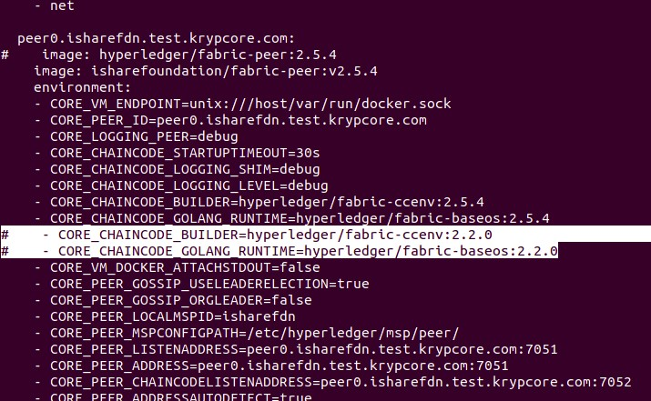

5.  Execute the below command, which in turn provides permission for the
    directory and its contents.

```shell
sudo chmod -R 777 docker_data/
```

6.  Execute the below command, which allows to change the ownership of
    the directory and its contents.
```shell
sudo chown -R 1001:1001 docker_data/
```
7.  Redirect to below directory. Change the environment and orgname
    appropriately in the below command.

```shell
cd iSHARESatellite/hlf/<Environment>/<orgName>/
```

8.  Execute the below command to provide permission for the directory
    and its contents.

```shell
sudo chmod -R 777 crypto
```

9.  Redirect to below directory. Change the environment and orgname
    appropriately in the below command.

```shell
cd iSHARESatellite/hlf/<Environment>/<orgName>/peers
```

10. Start the container with the latest upgraded version of peer using
    the below command.

```shell
docker-compose -f docker-compose-hlf.yaml up -d
```shell

11. Verify the container's docker logs to make sure if container is
    running fine.

```shell
docker-compose -f docker-compose-hlf.yaml logs -f <peer0name>
```
12. To upgrade peer 1, execute step 4 by changing image version to
    latest upgraded version and start the service (Step 10, 11).

# Component #3: Couch DB

1.  Redirect to below directory. Change the environment and orgname
    appropriately in the below command.

```shell
cd iSHARESatellite/hlf/<Environment>/<orgName>/peers
```

1.  Using the below command, stop the docker container.

```shell
docker-compose -f docker-compose-hlf.yaml down
```
2.  Open the docker-compose-hlf.yaml and comment the current image
    getting used and add the updated image on both couchdb.peer 0 and
    couchdb.peer 1 and save the file. Refer the below snip on the
    highlighted command.

> 
> **image:
> isharefoundation/couchdb:v3.3.2**

3.  Using the below command, stop the docker container.

```shell
docker-compose -f docker-compose-hlf.yaml down
```

4.  Execute the below command, which in turn provides permission for the
    directory and its contents.

```shell
sudo chmod -R 777 docker_data/
```

5.  Execute the below command, which allows to change the ownership of
    the directory and its contents.

```shell
sudo chown -R 1001:1001 docker_data/
```

6.  Start the container with the latest upgraded version using the below
    command.

```shell
docker-compose -f docker-compose-hlf.yaml up -d
```

7.  Verify the container's docker logs to make sure if container is
    running fine.

```shell
docker-compose -f docker-compose-hlf.yaml logs -f <couchdb-containername>
```

# Component #4.1: Application Components-UI

1.  Redirect to below directory.

```shell
cd iSHARESatellite/ui
```

2.  Using the below command, stop the docker container.

```shell
docker-compose -f docker-compose-ui.yaml down
```

3.  Take a backup of docker-compose-ui.yaml file. Execute the below
    command for the backup activity.

```shell
cp docker-compose-ui.yaml docker-compose-ui.yaml-bkup
```

4.  Open the docker-compose-ui.yaml, refer to snip 1 to remove auth.
    After removing comment the current image getting used and add the
    updated image and save the file. Refer to the highlighted command in
    both the snips.

> 
>
> 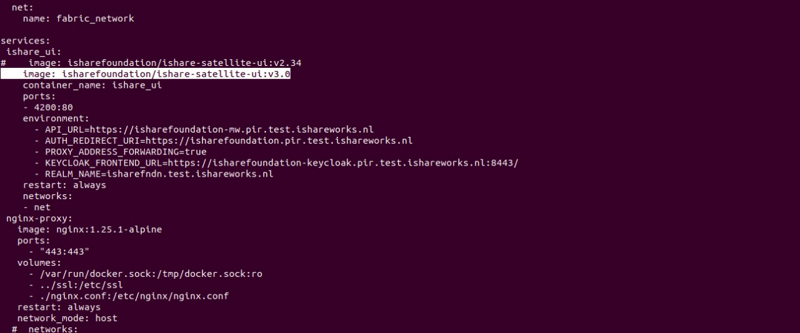
> **image:
> isharefoundation/ishare-satellite-ui:v3.0**

5.  Start the container with the latest upgraded version using the below
    command.
```shell
docker-compose -f docker-compose-ui.yaml up -d
```
6.  Verify the container's docker logs to make sure if container is
    running fine.
```shell
docker-compose -f docker-compose-ui.yaml logs -f ishare_ui
```

# Component #4.2: Application Components-MW

1.  Redirect to below directory.
```shell
cd iSHARESatellite/middleware
```
2.  Using the below command, stop the docker container.
```shell
docker-compose -f docker-compose-mw.yaml down
```
3.  Take a backup of docker-compose-mw.yaml file. Execute the below
    command for the backup activity.
```shell
cp docker-compose-mw.yaml docker-compose-mw.yaml-bkup
```
4.  Open the docker-compose-mw.yaml, refer to snip 1 to update image
    version and refer to snip 2 to add the highlighted lines in the
    volume section and comment the existing lines and save the file.

> 

**image:isharefoundation/ishare-satellite-app-mw:v4.18**
# 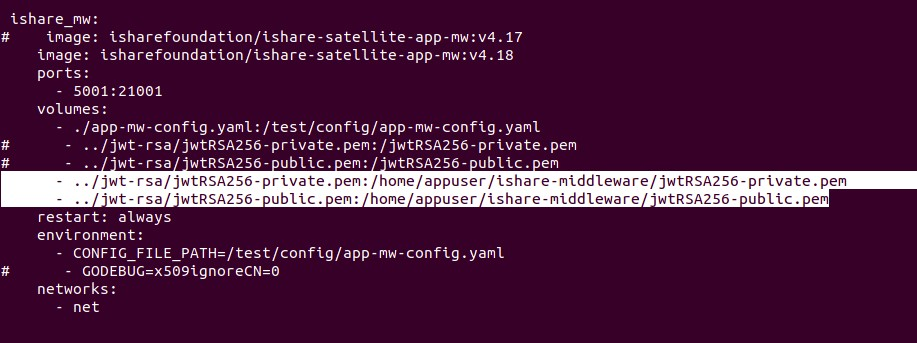

5.  Start the container with the latest upgraded version using the below
    command.
    
```shell
docker-compose -f docker-compose-mw.yaml up -d
```


6.  Verify the container's docker logs to make sure if container is
    running fine.

```shell
docker-compose -f docker-compose-mw.yaml logs -f ishare_mw
```

# Component #4.3: Application Components-HLF Middleware

1.  Redirect to below directory.

```shell
cd iSHARESatellite/middleware
```


2.  Open the docker-compose-mw.yaml, refer to snip 1 to update image
    version and save the file.

**image: isharefoundation/ishare-satellite-hlf-mw:v1.9**
> 

3.  Start the container with the latest upgraded version using the below
    command.

```shell
docker-compose -f docker-compose-mw.yaml up -d
```

4.  Verify the container's docker logs to make sure if container is
    running fine.

```shell
docker-compose -f docker-compose-mw.yaml logs -f ishare_hlf
```

# Component #4.4: Application Components-Chain Code

1.  Redirect to below directory.

```shell
cd iSHARESatellite/chaincode
```

2.  Using the below command, stop the docker container.

```shell
docker-compose -f cc-docker-compose-template.yaml down
```

3.  Take a backup of cc-docker-compose-template.yaml file. Execute the
    below command for the backup activity.

```shell
cp cc-docker-compose-template.yaml cc-docker-compose-template.yaml-bkup
```

4.  Open the cc-docker-compose-template.yaml, refer to snip 1 to update
    image version and remove the blue highlighted text and save the
    file.

> **image: isharefoundation/ishare-satellite-cc:v2.0**
>
> 


5. Comment the run command mentioned in **cc-docker-compose-template.yaml** as per the given sample image.
   > 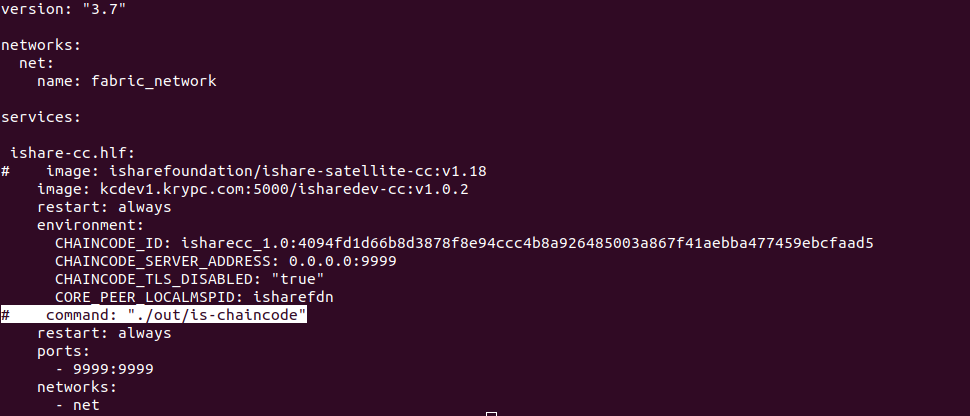
   
7. Start the container with the latest upgraded version using the below
    command.

```shell
docker-compose -f cc-docker-compose-template.yaml up -d
```shell


6.  Verify the container's docker logs to make sure if container is
    running fine.

```shell
docker-compose -f cc-docker-compose-template.yaml logs -f
```

# Component #5: Key Cloak

1.  Login to your Keycloak Admin. Reference example is:
    <https://myorg-keycloak-test.example.com:8443/auth>

2.  Click on Administration Console

> 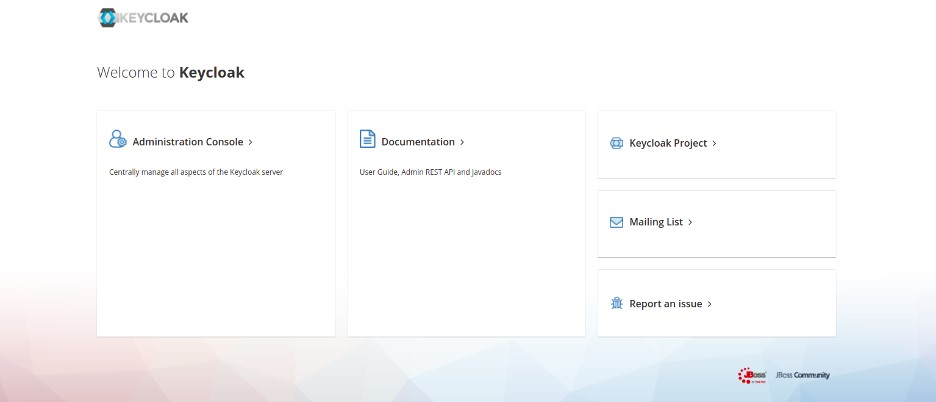

3.  
    Enter the login credentials. Username
    and Password for admin can be found in keycloak-docker-compose.yaml
    inside \"keycloak\" directory of the project folder.

5.  Click on 'Export'
    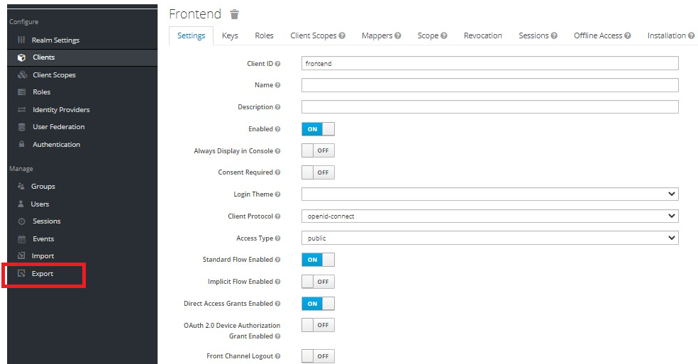
    

6.  Make sure 'Export groups and roles' and 'Export clients' options are
    turned on and then click on Export button. A json file
    (realm-export.json) will be downloaded to the system. This file will
    be used when in need to revert if any conflict occurs.

    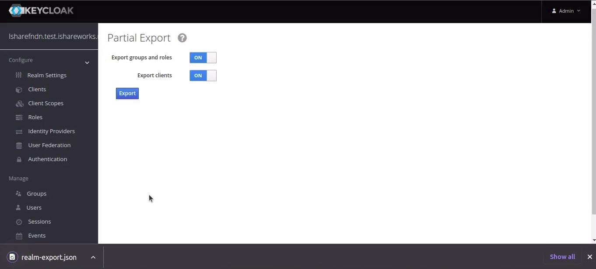

6.  Redirect to below directory.

```shell
cd iSHARESatellite/keycloak
```


7.  Using the below command, stop the docker container.

```shell
docker-compose -f keycloak-docker-compose.yaml down
```

8.  Take a backup of keycloak-docker-compose.yaml file. Execute the
    below command for the backup activity.

```shell
cp keycloak-docker-compose.yaml keycloak-docker-compose.yaml-bkup
```

9.  Redirect to iSHARESatellite folder and take a backup of the entire
    keycloak setup. Execute the below commands.

```shell
cd iSHARESatellite
```
```shell
sudo zip -r keycloak-bkup-<date>.zip keycloak/
```

10. Redirect to below directory.

```shell
cd iSHARESatellite/keycloak
```

11. Open keycloak-docker-compose.yaml. Existing lines should be removed
    and add new lines to the environment section of docker-compose. Save
    the file once changes are completed. Refer to the below textboxes.

**Note: \<KeycloakHostName\> has to be replaced with appropriate
value.**

12. Open the keycloak-docker-compose.yaml, refer to below snip to update
    image version and remove the blue highlighted text. Save the file
    once changes are done.

> **image: isharefoundation/ ishare-satellite-keycloak:v22.0.1**

> 

13. Run Command has to be changed in keycloak-docker-compose.yaml. Refer
    to below snip to update run command and remove the blue highlighted
    text. Save the file once changes are done.
    
   

15. Start the container with the latest upgraded version using the below
    command.

```shell
docker-compose -f keycloak-docker-compose.yaml up -d
```


15. Verify the container's docker logs to make sure if container is
    running fine.

```shell
docker-compose -f keycloak-docker-compose.yaml logs -f keycloak
```

16. Once Keycloak is up and running, Login to your Keycloak Admin.
    Reference example is:
    <https://myorg-keycloak-test.example.com:8443/admin>. Repeat Step 3
    to login.

> 

    
 17. After login, click on the realm
    dropdown to verify the realm name. Refer to below snip.

> 

18. Click on **Clients** menu and click on 'frontend' client ID. Verify
    it is updated as per the earlier settings.

> 

19. Click on **Users** menu to verify
    whether the users list are updated as per the earlier settings.
    
> 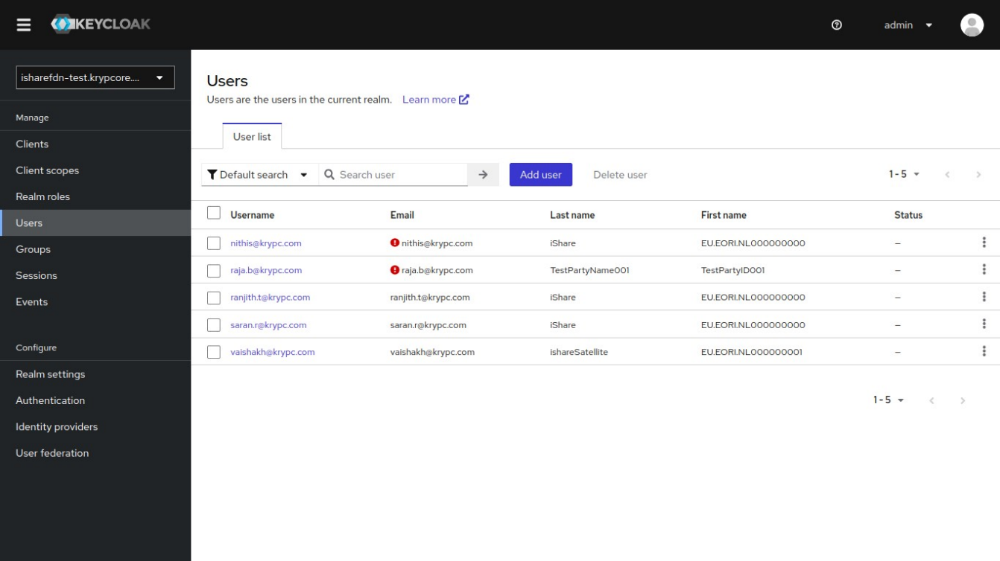
    
    

20.  Click on **Realm Settings** and verify
    **Email** config. Is updated as per the earlier settings.
> 
   
21.  Verify whether existing users are able
    to access the application. Login and verify participants and user
    data are displayed.
> 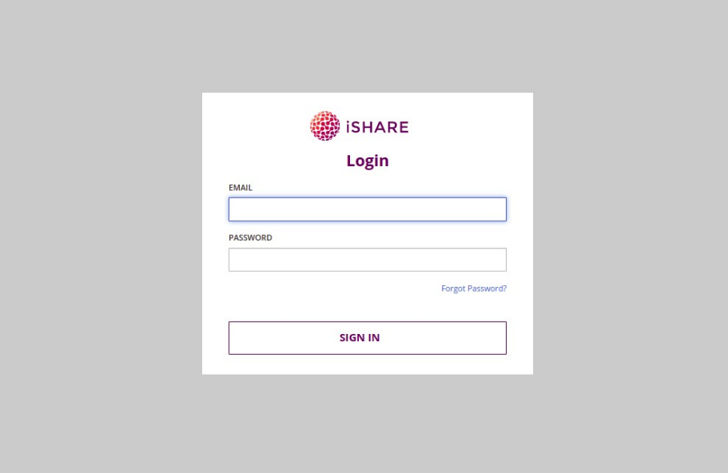
   

# Component #6.1: Postgres DB -- Key Cloak

1.  Redirect to below directory.

```shell
cd iSHARESatellite/keycloak
```

2.  Take a backup of existing postgress data dump. Execute the below
    command for backup activity.

```shell
docker exec -it keycloakpostgres pg_dump -U postgres -d keycloak-backup.sql
```

3.  Once after back up is completed, verify backup.sql is available in
    the working directory.

4.  Using the below command, stop the docker container.

```shell
docker-compose -f keycloak-docker-compose.yaml down
```


5.  Rename the existing postgres data folder (keyclockpostgres) as
    keyclockpostgres-13

6.  Open **keycloak-docker-compose.yaml** file and update the latest
    image version. Remove the image version that is highlighted in blue
    text. Save the file once changes are done. Refer the below snip.

**image: isharefoundation/postgressql:v15.0-alpine**

> 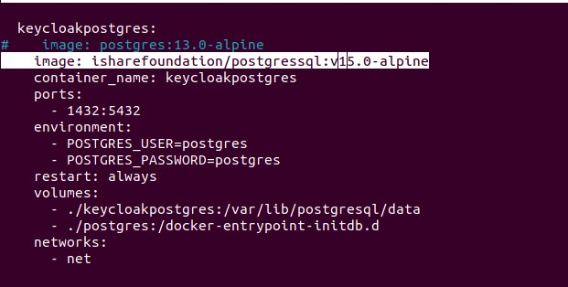

7.  Start the container with the latest upgraded version using the below
    command.

```shell
docker-compose -f keycloak-docker-compose.yaml up -d
```

8.  Verify the container's docker logs to make sure if container is
    running fine. Refer to below snip for the response output.

```shell
docker-compose -f keycloak-docker-compose.yaml logs -f keycloakpostgres
```
> 

9.  Restore the backup file (backup.sql) by executing the below command
    and verify the output. Refer to the below snip for the output
    example.

```shell
docker exec -i keycloakpostgres psql -U postgres -d keycloak-backup.sql
```
> 

# Component #6.2: Postgres DB -- Offchain Data

1.  Redirect to below directory.

```shell
cd iSHARESatellite/middleware
```

2.  Take a backup of existing postgress data dump. Execute the below
    command for backup activity.

```shell
docker exec -it offchain_sat pg_dump -U postgres -d offchaindata > backup.sql
```


3.  Once after back up is completed, verify backup.sql is available in
    the working directory.

4.  Using the below command, stop the docker container.

```shell
docker-compose -f docker-compose-mw.yaml down
```

5.  Rename the existing postgres data folder (postgresdata) as
    postgresdata-13

6.  Open **docker-compose-mw.yaml** file and update the latest image
    version. Remove the image version that is highlighted in blue text.
    Save the file once changes are done. Refer the below snip.

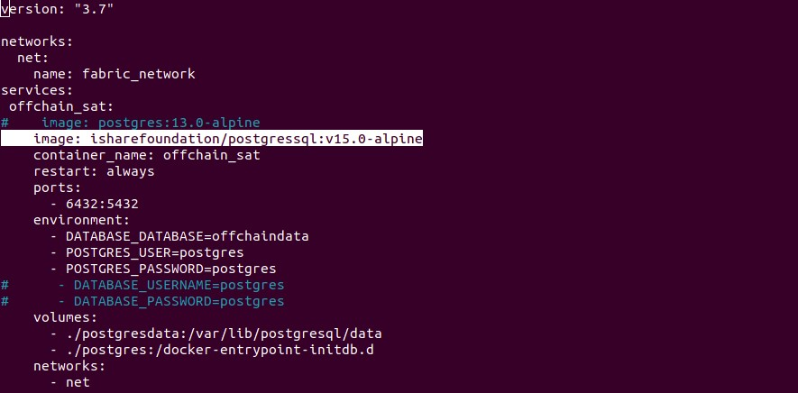
**image:
isharefoundation/postgressql:v15.0-alpine**

7.  Start the container with the latest upgraded version using the below
    command.

```shell
docker-compose -f docker-compose-mw.yaml up -d
```

8.  Verify the container's docker logs to make sure if container is
    running fine.

```shell
docker-compose -f docker-compose-mw.yaml logs -f offchain_sat
```

9.  Create a new offchaindb in new postgres 15 by executing the below
    command.

```shell
docker exec -it offchain_sat psql -U postgres -c "CREATE DATABASE offchaindata;
```

10. Verify whether the offchaindb is created correctly by executing the
    below command.

```shell
docker exec -it offchain_sat psql -U postgres -d offchaindata
```

11. Now restore the offchaindata in the postgres 15 by executing the
    below command. Refer to the below snip for example output.


```shell
docker exec -i offchain_sat psql -U postgres -d offchaindata < backup.sql
```

# Component #7: Explorer

1.  Redirect to below directory.

```shell
cd iSHARESatellite/explorer
```

2.  Using the below command, stop the docker container.

```shell
docker-compose -f explorer-docker-compose.yaml down
```

3.  Take the particular docker_data backup. Execute the below command
    for the backup activity.

```shell
sudo zip -r docker_data-explorer-bkup-<date>.zip docker_data/
```

4.  Open explorer-docker-compose.yaml file and update the latest image
    version for explorerdb and explorer service respectively. Remove the
    image version that is highlighted in blue text. Save the file once
    changes are done. Refer the below snips.


**image: 
ghcr.io/hyperledger-labs/explorer-db:2.0.0**


**image:
ghcr.io/hyperledger-labs/explorer:2.0.0**

5.  Start the container with the latest upgraded version using the below
    command.

```shell
docker-compose -f explorer-docker-compose.yaml up -d
```

6.  Verify the container's docker logs to make sure if container is
    running fine.

```shell
docker-compose -f explorer-docker-compose.yaml logs -f explorerdb
```shell

```shell
docker-compose -f explorer-docker-compose.yaml logs -f explorer
```

7.  Verify whether the explorerdb and explorer service are up and
    running by executing the below command.

```shell
docker-compose -f explorer-docker-compose.yaml ps
```

# Component #8: Orderer

1.  This section is specific for iSHARE foundation.

2.  Follow the pre-requisites backup activity.

3.  Rename the bin to bin-old and config directory to config-old from
    the project directory.

4.  Download the latest config for hlf setup using the given curl
    command and verify whether two folders are created in the name of
    bin and config.

```shell
curl https://raw.githubusercontent.com/hyperledger/fabric/master/scripts/bootstrap.sh | bash -s \-- 2.5.4 1.5.7 -d --s
```

5.  Move to config directory, copy **orderer.yml** file to the path
    where the orderer compose file is present.

6.  Redirect to the below given directory where the orderer
    docker-compose file is present in the server. Change the
    **<Environment>/<orgName>** to appropriate values.

```shell
cd iSHARESatellite/ hlf/<Environment>/<orgName>/orderers
```

7.  Take the particular docker_data backup. Execute the below command
    for the backup activity.

```shell
sudo zip -r docker_data-orderer-bkup-<date>.zip docker_data/
```

8.  Open and edit the compose file to update the image version (snip 1).
    After image update, update the environment section with new entry
    (snip 2). Once after, update the Boolean section with the new mount
    point (snip 3). Save the file after all three changes are done.

**Image:** **hyperledger/fabric-orderer:2.5.4**

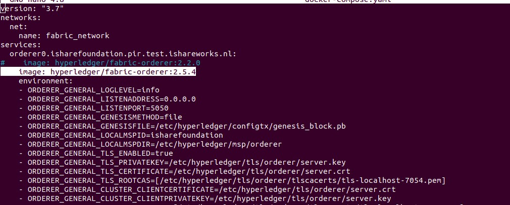

Environment session:
```shell
- FABRIC_CFG_PATH=/sample/config
```

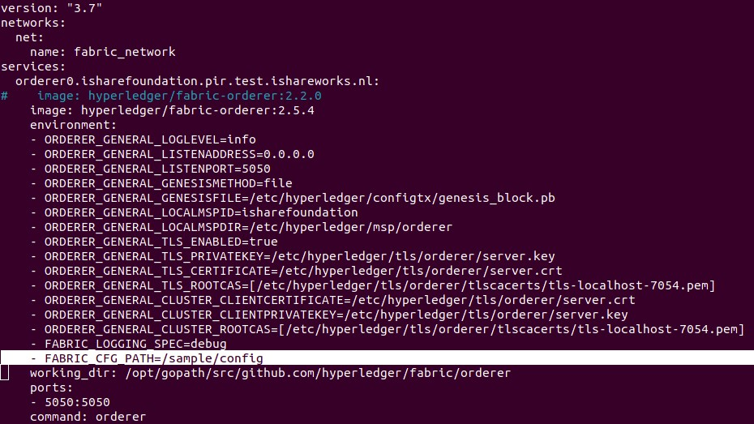

```shell
- ./orderer.yaml:/sample/config/orderer.yaml
```

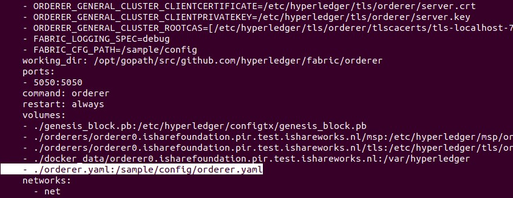

9.  Using the below command, stop and remove the docker container.

```shell
docker-compose down
```

10. Start the container with the latest upgraded version using the below
    command.

```shell
docker-compose up -d
```

11. On executing the above command orderer 0 should be updated to latest
    version.

12. Verify the container's docker logs to make sure if container is
    running fine.

```shell
docker logs -f <orderer0 name>
```

13. Once after orderer 0 is up and running properly, execute the steps
    (8-12) for other orderers one after another.

    a.  Note: All the orderers should not be upgraded at once.
